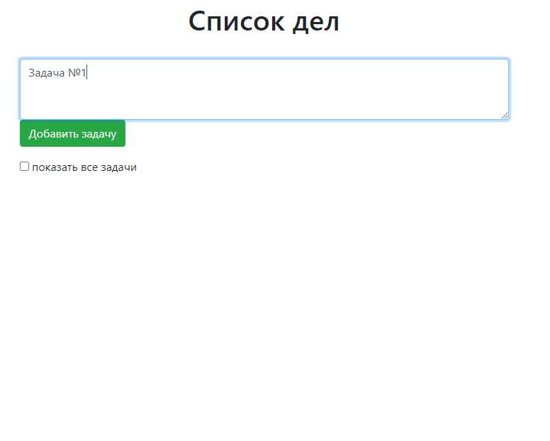
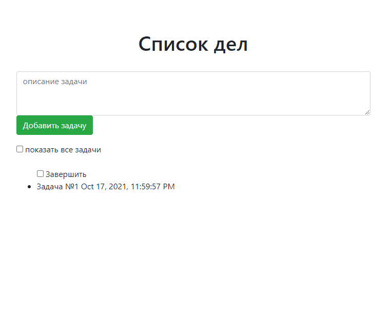
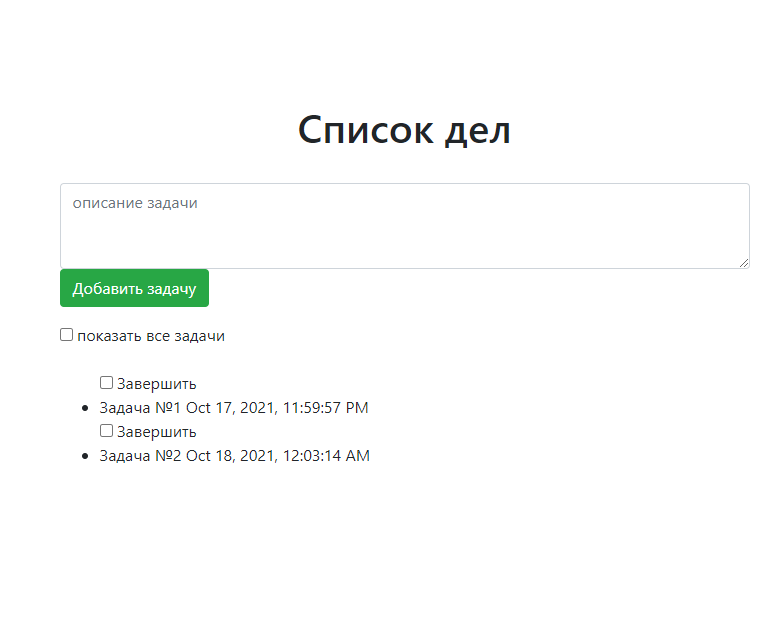
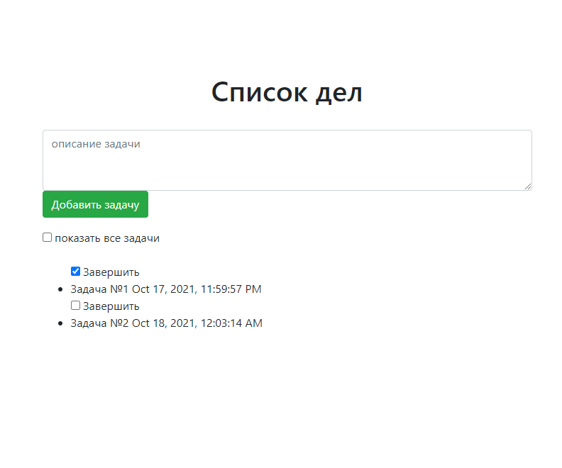
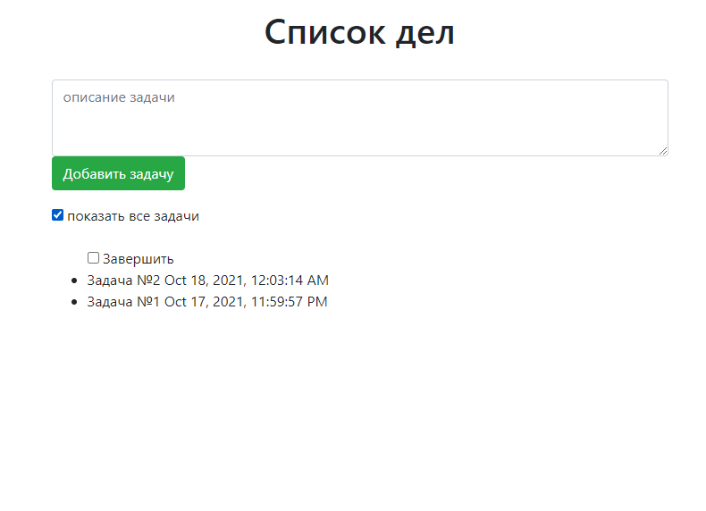

<h1>
job4j_todo
</h1>

<h3>
Description :
</h3>

This project represent todo list web-service 

<h4>
Used technologies :
</h4>
<ul>
<li>Servlets</li>
<li>Hibernate</li>
</ul>

Web-Service has a 1 screen with 3 functions :

<ul>
<li>
Create new task
</li>
</ul>
<ul>

<li>
Display undone tasks 
</li>
</ul>

<ul>
<li>
Complete task
</li>
</ul>

<ul>
<li>
Display done task
</li>
</ul>

<h3>
Configurations :
</h3>

To app boot is necessary use Apache Tomcat and edit run configuration. 
This configuration should have follow points : 

<ul>
<li>
'http://localhost:8080/todo' as start page url;
</li>
<li>
'job4j_todo:war exploded' as build artifact;
</li>
<li>
'/todo' as application context
</li>
</ul>
<h3>Contact</h3>

If You have any question, please contact me:

https://t.me/roman_kozlov

